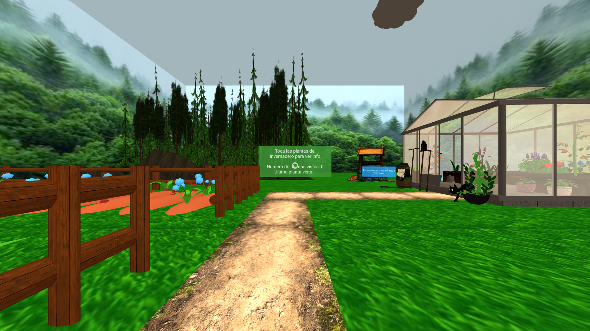
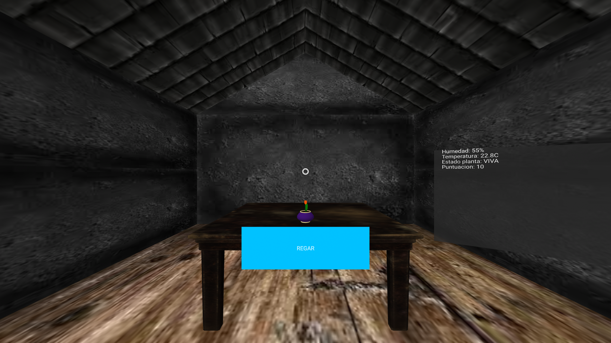

# Tour Virtual Invernadero - Experiencia Creativa

> **Equipo:** María y Darío  
> **Opción:** A) Familia agraria (jardines)  
> **URL:** [https://meer1b.github.io/proyecto-vr/](https://meer1b.github.io/proyecto-vr/)

---

## 1. Tecnología: A-Frame

| Característica | Descripción |
|----------------|-------------|
| Imágenes 360° | `<a-sky>` para mostrar jardines y paisajes |
| Modelos 3D | `<a-gltf-model>` para plantas, invernadero, muebles y objetos |
| Interactividad | `event-set`, `animation`, `cursor-listener`, `multi-plant`, `show-info` |
| VR | WebXR compatible con PC, móvil y Oculus/Quest |

---

## 2. Las 3 Escenas principales

| Escena | Tipo | Contenido |
|--------|------|-----------|
| 1 | 360° | Jardín con audio ambiental y portal hacia el invernadero 
| 2 | 3D | Invernadero interactivo: plantas, contador de plantas vistas, panel de info, sonido ambiental |
| 3 | 3D | Invernadero con simulación de riego, panel de datos operativos y plantas que evolucionan según interacciones |

---

## 3. Criterios de Evaluación

| Criterio | Evidencia en software | Evidencia en README.md |
|----------|--------------------|----------------------|
| a) Tecnologías habilitadoras digitales | Uso de A-Frame, `<a-scene>`, `<a-sky>`, `<a-gltf-model>` | Tabla de características de A-Frame |
| b) Relación con productos/servicios | Escena 2 y 3 muestran plantas interactivas, info y riego | Explicación de experiencia educativa y de simulación |
| c) Sostenibilidad | Assets optimizados (<2MB para 360°, <1MB para modelos), carga rápida | Impacto ambiental reducido: evita visitas físicas al jardín |
| d) Nuevos mercados | Experiencia educativa y de simulación remota | Turismo virtual, edutainment |
| e) Negocio + Planta | Escena 1 = experiencia visual, Escenas 2-3 = simulación de invernadero | Análisis de negocio y operativa |
| f) Mejoras IT + OT | Datos dinámicos, paneles en tiempo real, multi-dispositivo | Explicación de ventajas de digitalización |
| g) Informe | — | Este README.md cumple como documentación profesional |

---

## 4. Sostenibilidad

- Ahorro de CO₂: visitas virtuales evitan desplazamientos → reducción estimada: 2 kg CO₂ por visita.  
- Eficiencia: carga < 5s en móvil, assets ligeros, optimización de modelos y texturas.  
- Impacto educativo: permite aprendizaje remoto y seguro sobre horticultura y riego.  

---

## 5. Capturas

  
  
  

---

## 6. Uso

1. Abre la URL en cualquier navegador compatible con WebXR.  
2. Haz click en los portales para navegar entre escenas.  
3. Interactúa con objetos y plantas:  
   - Escena 2: click en plantas para ver info.  
   - Escena 3: click en botón "REGAR" para activar la simulación.  
4. VR: usar gafas compatibles Oculus/Quest para inmersión total.

